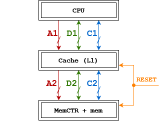

# Модель работы кэша
Модель работы кэша процессора с политиками вытеснения LRU, bit-pLRU и Round-robin.

Модель используется для определения процента попаданий и общего времени (в тактах), затраченного на выполнение кода на языке C:

```C
#define M 64
#define N 60
#define K 32
int8 a[M][K];
int16 b[K][N];
int32 c[M][N];


void mmul()
{
  int8 *pa = a;
  int32 *pc = c;
  for (int y = 0; y < M; y++)
  {
    for (int x = 0; x < N; x++)
    {
      int16 *pb = b;
      int32 s = 0;
      for (int k = 0; k < K; k++)
      {
        s += pa[k] * pb[x];
        pb += N;
      }
      pc[x] = s;
    }
    pa += K;
    pc += N;
  }
}
```

Моделируемый кэш используется только для работы с данными (не командами).
Массивы хранятся в памяти последовательно.
Все локальные переменные лежат в регистрах процессора.

# Система “процессор-кэш-память”



##### Размерность шин
| Шина   | Обозначение                  | Размерность    |
|--------|------------------------------|----------------|
| A1, A2 | ADDR1_BUS_LEN, ADDR2_BUS_LEN | 16 бит, 11 бит |
| D1, D2 | DATA1_BUS_LEN, DATA2_BUS_LEN | 16 бит         |
| C1, C2 | CTR1_BUS_LEN, CTR2_BUS_LEN   | 3 бит, 2 бит   |

# Время
Время отклика – расстояние в тактах от первого такта команды до первого такта ответа.
Для моделируемой системы:
+ 6 тактов – время, через которое в результате кэш попадания, кэш начинает отвечать.
+ 4 такта – время, через которое в результате кэш промаха, кэш посылает запрос к памяти.
+ 100 тактов – время, через которое память начинает отвечать.
	
Время передачи данных по шинам для моделируемой системы:
+ По шинам A1 и A2 адрес передаётся за 1 такт.
+ По шинам D1 и D2 в каждый такт передаётся по 16 бит данных.
+ По шинам C1 и C2 команда передаётся за 1 такт.


# Параметры системы
| <!-- -->                 | <!-- -->                   |
|--------------------------|----------------------------|
| MEM_SIZE                 | 65536 байт                 |
| ADDR_LEN                 | 16 бит                     |
| Конфигурация кэша        | look-through write-back    |
| Политики вытеснения кэша | LRU, bit-pLRU, Round-robin |
| CACHE_WAY                | 4 линии                    |
| CACHE_TAG_LEN            | 6 бит                      |
| CACHE_IDX_LEN            | 5 бит                      |
| CACHE_OFFSET_LEN         | 5 бит                      |
| CACHE_SIZE               | 4096 байт                  |
| CACHE_LINE_SIZE          | 32 байт                    |
| CACHE_LINE_COUNT         | 128                        |
| CACHE_SETS_COUNT         | 32                         |


